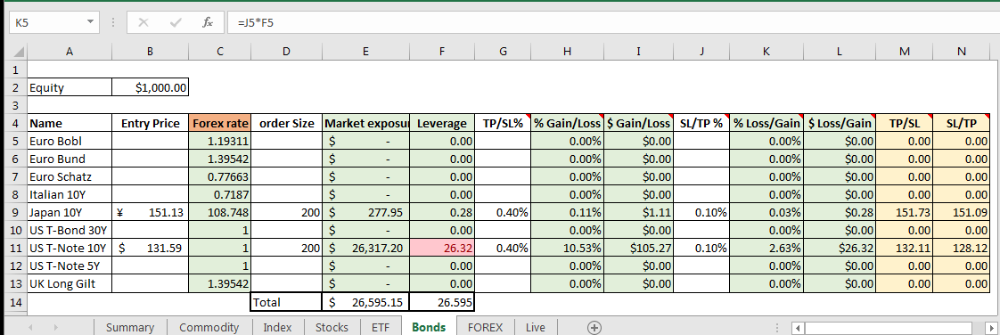

# Bridge
This project consists of 2 scripts &amp; 2 excel templates that help in preemptive risk management. It only works with MT5 Terminal and requires Metatrader5 python module.

There are 2 apps in the project, one for observing minimum exposures i.e. What would be your minimum possible exposure if you want to trade on that perticular assset. And the other to calculate things like potential profits/losses on long/short positions.

## Usage
Start MT5 terminal, open the excel file template and launch the specific python script in the perticular folder. Make sure you have an active connection with the brokers server. Once you start the python script, it will push asset price data to the respective cells in the spreadsheet. examples are shown below.

## Minimum exposure

The above example shows the index sheet. This is how every sheet is structured. Every sheet in the excel file consists of similar tables, for different assset classes.
  - The **Name** column is for the name/symbol of the asset. 
  - **Price** column(5B) is for the current price of the asset, it will keep updating every 20 seconds, you can change the frequency of updates by passing a number in `time.sleep(n)` method.
  - **Forex rate** column(5C) is the USD conversion rate to calculate exposure in USD, it will auto-update as well. 
  - **Forex Adj** column(5D) shows the price of that asset in USD.
  - **min order size** column(5E) shows smallest position of one can take. Change it according to the brokers guidlines.
  - **market exposure** column(5F) shows exposure in USD for taking the bare minimum position.
  - **Leverage** column(5G) indicates how much your account will be levered if you take a bare minimum position on that asset. As you can see, taking a minimum position on CAC40, levers the account 7.18x, i.e. a negative change of 13% in the asset can wipeout the account. Cells turns red if the leverage is too high for this perticular asset class. This column is helpful to observe which assets are safer to trade (that is offcourse, if you know how to trade them.).
  - Following columns are for testing for volatility, i.e. for %change in price of asset how much % & dollars the account will gain or lose, as you can see, for a move of 0.96% in CAC40 the account will gain/lose 6.31% or $69.13.
  - lastly cell 2B shows the accounts current equity.

### stocks sheet

In addition to other things, stocks and ETF sheets show daily Rollover charges for long/short positions in two separate columns. However, you will need to insert the interest rates for long/short positions in the cells B4 & B5.

The Minimum exposure excel file has sheets for commodities, indices, Stocks, ETF's, Bonds and Forex. If your broker provides a different set of assets,
make changes in the asset lists and dictionaries and the `while` loop. might want to change the template as well

## Market Exposure

The above example shows using Market Exposure excel sheet before trading sovereign bond futures. As you can see buying 100 Japanese 10Y bond futures is safer in terms of leverage than 200 US 10-Year futures. If we go long on both, a gain of 50bp on Japanese 10Y will give 7bp gain to account, similar type of assessment for US 10-Year future.

Market exposure is similar to minimum exposure, except, it expects input from the user.
  - Enter the price at which you want to make an entry in **Entry Price** column.
  - The **Forex rate** column will auto-update.
  - Enter the quantity of securities you want to buy in **order size** column.
  - **Market exposure** column will show you exposure on that asset in USD.
  - **Leverage** column will show leverage on that asset, it will turn red if leverage too high (Ignore if know what you are doing, Lol).
  - The following column(G) takes take-profit(in %) for long, and stop-loss for short positions. Columns H & I will show you percent and Dollar gain for long positions or percent and dollar loss for short position.
  - The following 3 columns are the opposit.
  - Basically, if you are going to take a long position insert TP in column G and SL in column J and if you are taking a short position insert SL in column G and TP in column J.
  - column M & N will show the price point at which TP & SL should be.

The Market exposure spreadsheet has similar sheets for different asset classes like commodities, indices, stocks(US), ETFs(US), Bond futures and forex. Feel free to make changes according to your broker.

Note: I do not take responsibility for any financial losses you may incure, test the software properly in demo before going live.
